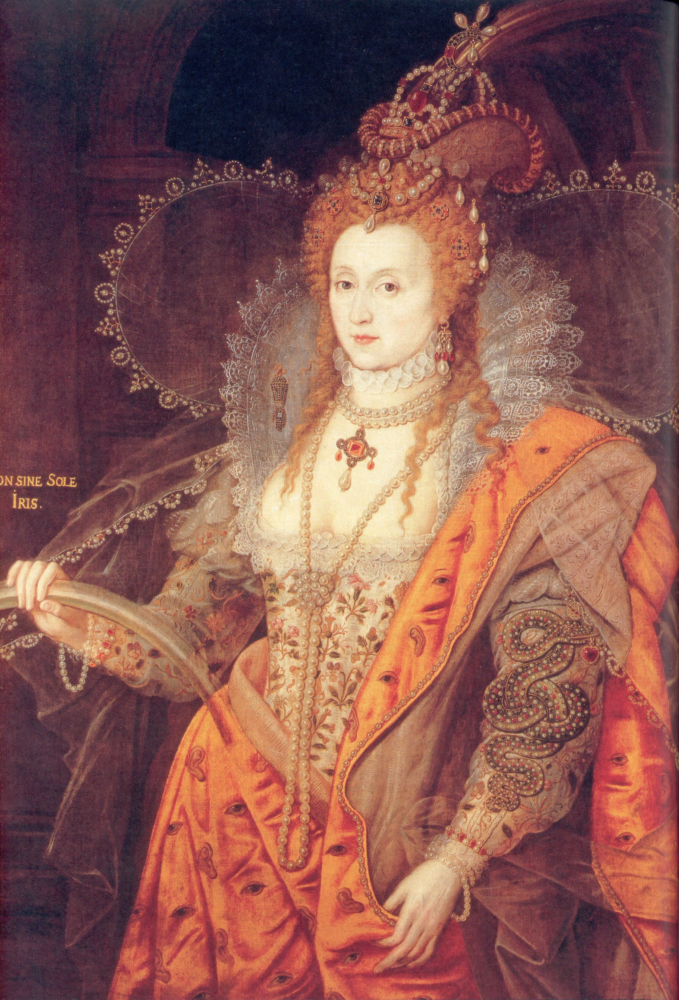

:css: css/aarhus.css

.. title: Predestination and Prediction: Reformation theology and state surveillance
.. abstract: With the rise of predictive policing and data analysis
   practices that seem to constrain and call into question free will,
   this paper argues that the literature of a particular theological
   struggle—predestination—uncovers otherwise hidden depths in the
   histories of surveillance. With gestures toward post–9/11
   surveillance, this paper argues that predestination underlies the
   creation of one of the earliest cultures of modern state
   surveillance: Elizabethan England. Following the Northern Rebellion
   of 1569, calls for greater scrutiny of Catholics used religious
   discourses of divine omniscience of predetermined futures
   characteristic of the period. But the state religion on which the
   Elizabethan regime rested had to confront the potentially
   subversive paradoxes of predestination. Proceeding from how
   Calvin’s theology of predestination creates new kinds of secret
   subjects, I turn to texts that called for surveillance following
   the 1569 rebellion. By examining the pre-secular Reformation
   period, this paper argues that a religious genealogy of early
   modern surveillance points to the ways twenty-first century
   surveillance dreams of control through prediction.

----

:id: title

Predestination and Prediction
=============================

Reformation theology and state surveillance
-------------------------------------------

- ..
- William Pierce
- ..
- Northwestern University
- ..
- & Lucy Parsons Labs
- ..
- `mail@pierwill.com`

----

.. note::

   With the rise of predictive policing and data analysis practices that seem to constrain and call into question free will, this paper argues that the literature of a particular theological struggle—predestination—uncovers otherwise hidden depths in the histories of surveillance. With gestures toward post–9/11 surveillance, this paper argues that predestination underlies the creation of one of the earliest cultures of modern state surveillance: Elizabethan England. Following the Northern Rebellion of 1569, calls for greater scrutiny of Catholics used religious discourses of divine omniscience of predetermined futures characteristic of the period. But the state religion on which the Elizabethan regime rested had to confront the potentially subversive paradoxes of predestination. Proceeding from how Calvin’s theology of predestination creates new kinds of secret subjects, I turn to texts that called for surveillance following the 1569 rebellion. By examining the pre-secular Reformation period, this paper argues that a religious genealogy of early modern surveillance points to the ways twenty-first century surveillance dreams of control through prediction.

   I'm going to begin with a contemporary visual example as a motivation. Then I'll dive into the history. I'll example an important document.

----

:id: questions

.. QUESTIONS

- What are the ideological underpinnings of surveillance as prediction?
- What is the role of theology in the history of surveillance?

----  

:id: timeline

Chronology
==========

.. note:: Religious conflict and English politics

- **1517**
- ..
- Lutheran revolution
- **1534**
- ..
- Henry VIII named head of the Church of England
- **1545–1563**
- ..
- Council of Trent begins the Counter-Reformation
- **1553–1558**
- ..
- Reign of Mary Tudor
- **1558**
- ..
- Elizabeth I ascends
- **1569**
- ..
- Northern Rebellion
- **1588**
- ..
- Spanish Armada defeated
- **1603**
- ..
- Elizabeth dies; coronation of James I
- **1605**
- ..
- Gunpowder Plot (November 5)

----

:id: perkins

.. image:: img/chain.jpg
	   :height: 600px

“A ſurvey or Table declaring the order of the cauſes of ſalvation and damnation according to Gods word,” in William Perkins, *The Golden Chain* (London, 1592).

Image: Folger Shakespeare Library.

----

:id: perkins-det

.. image:: img/chain-det2.jpg
	   :width: 1000px
	   :align: center

----

:id: wisc

.. image:: img/wisc.jpg
	   :height: 600px

Wisconsin Department of Corrections, “Offender Life Cycle.” Published in Julia Angwin et al., “Machine Bias,” *ProPublica*, May 23, 2016.

----

.. image:: img/wisc-det1.jpg
	   :width: 1000px

----

.. image:: img/wisc-det2.jpg
	   :width: 1000px

----

:data-scale: 3
:data-x: r-7000
:data-y: r3000

:id: both-img

.. image:: img/chain.jpg
	   :width: 50%
	   :height: 750px

.. image:: img/wisc.jpg
	   :width: 50%
	   :height: 750px

.. note::

   Together these two images suggest that predestination is a good way of thinking through these problems today.
   
   BEGIN[#1] WITH WILLIAM PERKINS AND WISCONSIN ALGORITHM.  A godlike view of time and a individual fate from above. Process or sequence?  What kind of structure Cause and effect? COMPAS is a decision tree in prospective view, PERKINS is a decision tree in eternity.

----

:data-x: r5000
:data-y: r0

.. note:: BLANK

----

:id: rainbow
:data-scale: 3
:data-x: r5000

The “Rainbow Porait,” attrib. Marcus Gheeraerts the Younger, circa 1600.

----

:id: herle-letter
:data-scale: 1

.. image:: img/herle.jpg
	   :height: 600px

Letter by William Herle, 1571.

Image: Centre for Editing Lives and Letters, University College London.

----

:id: herle-fair
:data-y: r1000
:data-x: r0
     
.. image:: img/herle-fair.jpg
	   :height: 600px

A letter by Herle in a fair copy by one of Burleigh’s secretaries.

Image: Centre for Editing Lives and Letters, University College London.

----

.. note:: BLANK TK

----

:id: herle-exacte-book

ytt asketh then (so plesing your highnes) an exacte booke, describeng every parte of your Reallme…… The which substancially deciphred, might appere from tyme to tyme, as a certayn monument satisfieng every dowtt… & if the remnant were throwly deciphred, it were a grett assuranc to the state. Again Religion shold be the more assured, & mani execrable sectes eschewed, which kindle men dangerowsly bothe against God & their Soveraigne.

- Herle to Elizabeth I, October 1571

..

----

.. note:: BLANK TK

----

:id: lpl

	   
----

.. note:: END
