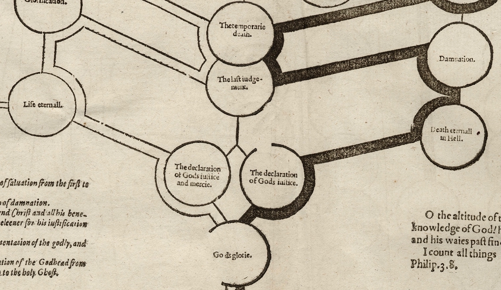

:css: css/aarhus.css

.. title: Predestination and Prediction: Reformation theology and
   state surveillance

.. abstract: With the rise of predictive policing and data analysis
   practices that seem to constrain and call into question free will,
   this paper argues that the literature of a particular theological
   struggle—predestination—uncovers otherwise hidden depths in the
   histories of surveillance. With gestures toward post–9/11
   surveillance, this paper argues that predestination underlies the
   creation of one of the earliest cultures of modern state
   surveillance: Elizabethan England. Following the Northern Rebellion
   of 1569, calls for greater scrutiny of Catholics used religious
   discourses of divine omniscience of predetermined futures
   characteristic of the period. But the state religion on which the
   Elizabethan regime rested had to confront the potentially
   subversive paradoxes of predestination. Proceeding from how
   Calvin’s theology of predestination creates new kinds of secret
   subjects, I turn to texts that called for surveillance following
   the 1569 rebellion. By examining the pre-secular Reformation
   period, this paper argues that a religious genealogy of early
   modern surveillance points to the ways twenty-first century
   surveillance dreams of control through prediction.

----

:id: title

Predestination and Prediction

Reformation theology and state surveillance

- ..
- William Pierce
- ..
- Northwestern University
- ..
- `mail@pierwill.com`

.. note::

   *Detail from the “Rainbow Porait,” of Queen Elizabeth I*

   *Marcus Gheeraerts the Younger (attrib.), circa 1600*

   \-----\

   In her beautiful and important book *Carceral Capitalism*, Jackie Wang writes in our racialized security states, “uncertainty is presented as an information problem.” Inherited from both finance capitalism and scientific research, “big data” surveillance oftens aims to mitigate risk. More information equals a better prediction of the future.

   But as the `Church of Scotland`_ has recently written, “God does not gather information about us.” God is, however, omniscient.
   
   With the rise of predictive policing and data analysis practices that seem to constrain and call into question free will, I argue that the literature of a particular theological struggle—predestination—uncovers otherwise hidden depths in the histories of surveillance.

   The theology of predestination there at the creation of one of the earliest cultures of modern state surveillance: Elizabethan England.

   Here’s what I’ll do in this presentation:
   
   - I'll to begin with a visual example as a motivation.
   - Then I'll dive into the history.
   - Last I'll look at a case study and a text (a spy story).

   \------------------------------\

   If I only tell you one thing about Predestination *Predestination is secret*. John Calvin calls is “an admirable secret of the judgement of God.” He wrote that Predestination implies the existence of information that could infallibly predict a persons future.  That information is secret and accessible only to God. It is totally opaque to mortals. But there has to be some sort of process. Inquiring into it was like pressing into God’s secret closet [room].

   Predestination is an important paradigm of knowledge from above judging and determining an individual’s future; because for God, to know and to do are the same thing. Predestination follows from God’s omniscience: if God knows everything, he knows all of eternity, so he knows and has already chosen those who will be saved.

   In addition: An important metaphor to remember: Book of Life.

   I’ll start with a visual example. This is the first:

----

:id: perkins

.. image:: img/chain.jpg
	   :height: 600px

“A ſurvey or Table declaring the order of the cauſes of ſalvation and damnation according to Gods word,” in William Perkins, *The Golden Chain* (London, 1592).

(Image: Folger Shakespeare Library)

.. note::

   This is from the theologian Protestant William Perkins’ book *The Golden Chain*. It’s a visual aid for understanding predestination.

----

:id: perkins-det1

.. image:: img/chain-det1.jpg
	   :width: 1000px
	   :align: center

(detail)

.. note::

   Notice how things eminate from the Trinity. The Trinity exists in eternity, outside of time.

----

:id: perkins-det2

(detail)

.. note::

   Things end back in eternity.

   Is this decision tree choice or the illusion of choice? What does it say about the internal workings of power on individuals?

   Next, let’s look at an image from a more contemporary archive:

----

:id: wisc
:data-rotate-y: r-90
:data-x: r1200
:data-y: r0
:data-z: r700

Wisconsin Department of Corrections, “Offender Life Cycle.”

(Image: published in Julia Angwin et al., “Machine Bias,” *ProPublica*, May 23, 2016.)

.. note::

   This document shows a different kind of predestination. It’s from the Wisonsin Department of Corrections and shows an algorithmic process for PAROLE based on a PROPRIETARY SYSTEM by a private contractor.

----

:id: wisc-det1
:data-rotate-y: r0
:data-x: r0
:data-y: r0
:data-z: r2000

.. image:: img/wisc-det1.jpg
	   :width: 1000px

(detail)

.. note::

   Arrest, Charges, Determination of Guilt:

   Only the first three boxes here (its own kind of holy trinity) exist in what we’d call due process. But the graph presumes guilt retrospectively and prospectively.

----

:id: wisc-det2

.. image:: img/wisc-det2.jpg
	   :width: 1000px

(detail)

----

:id: both-img
:data-scale: 2
:data-x: 0
:data-y: 2000
:data-z: 0
:data-rotate-y: r-90

.. image:: img/chain.jpg
	   :width: 50%
	   :height: 750px

.. note::

   (pause)

   Together these two images suggest that predestination is a good way of thinking through these problems today.

   A godlike view of time and a individual fate from above.

   - Process or sequence?
   - What kind of structure Cause and effect?
   - COMPAS is a decision tree in prospective view, PERKINS is a decision tree in eternity.

   This example is about mass incarceration. Further on I’ll be talking more in the context of predicting the future and avoiding risk in the rise of *national security surveillance states*.

----

:id: timeline
:data-x: r-8000
:data-y: r0
:data-z: r0
:data-rotate-y: r0

Chronology
==========

- **1517**
- ..
- Lutheran revolution
- **1534**
- ..
- Henry VIII becomes head of the Church of England (England becomes Protestant)
- **1558**
- ..
- Elizabeth I crowned
- **1569**
- ..
- Northern Rebellion

.. note::

   In 1569, a large but short-lived rebellion by two Northern nobles became first large-scale test of the Elizabethan Settlement (wherein a compromise was made allowing Catholics to retain their old beliefs in exchange for hefty fines and loss of some privileges). Elizabeth famously made these policies “not liking to make windows into men’s hearts and secret thoughts.” But after the rebellion, official sermons (which were required listening) included a new homily against rebellion (featuring the verse from Ecclesiastes that Michael told us about.) After the Northern Rebellion predestination and providential futurity were deployed as intellectual weapons.

   Following the Northern Rebellion of 1569, calls for greater scrutiny of Catholics used religious discourses of divine omniscience and providential future. The state religion on which the Elizabethan regime rested had to confront the potentially subversive paradoxes of predestination.

   SUMMARIZE NORTON IN TWO SENTENCES?

----

:id: herle-letter
:data-scale: 1

.. image:: img/herle.jpg
	   :height: 600px

Letter by William Herle, 1571.

Image: Centre for Editing Lives and Letters, University College London.

.. note::

   In 1571 a little-known spy and sometime diplomat named William Herle wrote to Queen Elizabeth with an entrepreneurial proposal. (Has anyone here heard of William Herle?) He wanted to be put in charge of a “survey of strangers.” This might be the earliest known usage of the term “survey” in English to mean large-scale government information gathering on individuals—“surveillance” in the modern sense.

   The presence of foreigners and the international political situation (with Spain and the Netherlands, France) writes Herle, is dangerous: “presaigeng som mete fere to be had.” A lack of centralized information about foreigners and possible “underminers” leaves “the cheeff mistery unknowen.”

   Herle’s language is not technically theological (nor would it be), but its underlying logic assumes a providential future to be known beforehand (presaged) and charged secrets (mystery) to be found out by a “survey.” It is the language of faithful, loving fear of the future. Herle emphasizes Elizabeth’s care for her subjects throughout his letter.

   Herle proposes the creation of a register of all foreigners10, what their faith is, what they’re doing in England, etc. He says:

----

:id: herle-exacte-book

ytt asketh then (so plesing your highnes) an **exacte booke**, describeng every parte of your Reallme…… The which substancially **deciphred**, might appere from tyme to tyme, as a **certayn monument satisfieng every dowtt**… & if the remnant were throwly deciphred, it were a grett assuranc to the state. Again Religion shold be the more assured, & mani execrable sectes eschewed, which kindle men dangerowsly **bothe against God & their Soveraigne**.

- William Herle to Elizabeth I, October 1571

.. note::
   
   *ytt asketh then (so plesing your highnes) an exacte booke, describeng every parte of your Reallme…… The which substancially deciphred, might appere from tyme to tyme, as a certayn monument satisfieng every dowtt… & if the remnant were throwly deciphred, it were a grett assuranc to the state. Again Religion shold be the more assured, & mani execrable sectes eschewed, which kindle men dangerowsly bothe against God & their Soveraigne.*

   I think this “exact book” can be (and would have been) understood as a shadow of the Book of Life—the persistent metaphor for predestination in biblical and religious literature.  (Maybe the Domesday Book as well, though I’m less sure about this.) Herle was a down-on-his-luck character, and his survey’s appearing “from time to time” is a canny bid for employment. More cannily, though, Herle’s program provides an answer to the challenges of Norton’s allegory. The Trojan Horse cannot be searched if it is fated to succeed. Providentia (providence) the scholastics tell us is a species of prudentia (prudence). But prudence demands that steps be taken to assuage doubt, whatever the fears; like Calvinist’s austere devotion.

----

:id: end

.. note::
   
   I argue state surveillance BEGAN under a religious culture, our historically informed understandings and critiques should not try to reinvent the wheel, but rather use theology CATEGORIES to help understand the cultural and social complexities with less reduction to today’s technical methods.

   Predestination implied the existence of information that could infallibly predict a persons future.  That information is secret and accessible only to God.

   Today we’re seeing a different belief that information about a person can help predict and judge their future actions. Where does this faith that more information will reveal the future come from? From mathematics, pragmatics, politics? We take it for granted that the future is uncertain, but we no longer believe in a divine sovereignty over the future. With predestination we can look to the pre-secular past as a model for thinking about the emerging paradigms of knowledge and prediction in these times.

   Today’s surveillance practices like “predictive policing” operate as a kind of secular version of predestination. (David Lyon has written about panoptic surveillance as “secular omniscience.”)[fn:1] The watcher comes to “know” the (likely) future through data collection in the present, and this knowledge is transmuted into judgment. But concerns about the erosion of free will by secular omniscience look different when accepting predestination on faith, and paradoxically as threat and comfort. If we think in historically appropriate theological terms about predestination, we find a structure for thinking about the politics and discourses of knowledge and future in our own surveillance societies.

   Three things about sixteenth-century England make it good for thinking about surveillance: 1) the assumption of divine omniscience meant that human secrecy could only be relative, 2) it is before the elaboration of bourgeois notions of privacy that can gum up our thinking, and 3) it is before the disciplinary mechanisms of the nineteenth century. This allows us to look elsewhere for surveillance—into the theological realm. In this world, theological concepts like predestination are necessary for talking about knowledge-over, knowing and judging secret intentions and futures.

   God’s omniscience was a given in the sixteenth century. If God is omniscient, then no one can keep a secret from God. God knows all secrets, intentions, and purposes, even those we ourselves do not. I call this divine surveillance: that aspect of God’s omniscience that makes human secrecy no more than relative, and implies – like Augustine’s confession – secrets beyond any other form of surveillance. The Reformation further internalized this surveillance for the individual believer, removing much of the priest’s mediating surveillance and emphasizing the necessity of salvation by faith alone. In doing so, I argue, the Reformation introduced new kinds of secrecy and surveillance. It did so in England especially by the political divisions it created. Suddenly, you could be a secret Catholic. Elizabeth’s government worried about Catholic plotters and assassination attempts.

   Into this rift across Europe, with a main fault line through England, Calvin’s writings added a powerful concept of predestination. For Calvin predestination is, above all, secret. “An admirable secret of the judgement of God.” Predestination as a doctrine is multiple in its secrecy. It means that the ultimate fate of each individual soul is a secret: to itself and to others, but not to God. Moreover, it is presented in such a way that the doctrine itself is secret. Calvin says that to inquire too far into the workings of predestination is to enter into impossible labyrinth. (This makes his chapter on predestination rich in paradox.) The English Articles of Faith call it “God’s counsel, secret to us.” So not only does the doctrine entail a secret state of affairs for each individual concerning his or her election, but the truth of the doctrine itself is secret. [[Mention the black-box nature of machine learning and neural network algorithms.]]

   Put simply, predestination injects secret, inaccessible knowledge into a compartment in each individual. When reformers, especially Calvin, began to emphasize this doctrine, it had profound political implications. How could the soul’s secret compartment not be politicized, militarized, surveilled, or desired? Every citizen, soldier, noble, counsellor, even monarch is predestined to election or damnation—and might be secretly be a Catholic conspirator.

   Divine surveillance—with all its paradoxes of jealous power and loving care—is the ideal and model of state surveillance in Elizabeth England. The monarch is the image of God, and should approximate omniscience in caring for her subjects, but of course can never attain it.  Still, just as all knowledge is an image of God’s knowledge, and all power an image of God’s power, all gathering of knowledge for power is an image of God’s knowledge as power.

   (Some researchers today talk about "Feedback loops": as if the whole thing didn't mirror *feedback loops* inherent in racist systems.)

.. Local Variables:
.. mode: rst
.. eval: (smart-quotes-mode)
.. End:

.. _`Church of Scotland`: http://www.srtp.org.uk/assets/uploads/Surveillance_and_Social_Justice_FINAL.pdf
