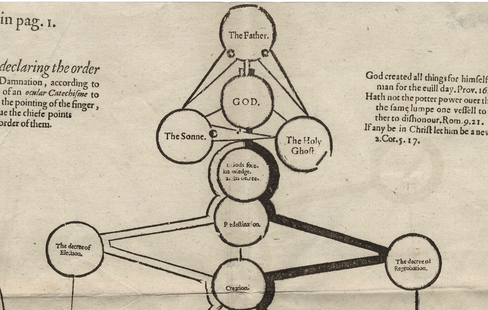

:css: css/aarhus.css

.. title: Predestination and Prediction: Reformation theology and
   state surveillance

.. abstract: With the rise of predictive policing and data analysis
   practices that seem to constrain and call into question free will,
   this paper argues that the literature of a particular theological
   struggle—predestination—uncovers otherwise hidden depths in the
   histories of surveillance. With gestures toward post–9/11
   surveillance, this paper argues that predestination underlies the
   creation of one of the earliest cultures of modern state
   surveillance: Elizabethan England. Following the Northern Rebellion
   of 1569, calls for greater scrutiny of Catholics used religious
   discourses of divine omniscience of predetermined futures
   characteristic of the period. But the state religion on which the
   Elizabethan regime rested had to confront the potentially
   subversive paradoxes of predestination. Proceeding from how
   Calvin’s theology of predestination creates new kinds of secret
   subjects, I turn to texts that called for surveillance following
   the 1569 rebellion. By examining the pre-secular Reformation
   period, this paper argues that a religious genealogy of early
   modern surveillance points to the ways twenty-first century
   surveillance dreams of control through prediction.

----

:id: title

Predestination and Prediction

Reformation theology and state surveillance

- ..
- William Pierce
- ..
- Northwestern University
- ..
- `mail@pierwill.com`

.. note::

   *Detail from the “Rainbow Porait,” of Queen Elizabeth I*

   *Marcus Gheeraerts the Younger (attrib.), circa 1600*

   \-----\

   In her book *Carceral Capitalism*, Jackie Wang writes that in our racialized security states, “uncertainty is presented as an information problem.” Surveillance today oftens aims to mitigate the risks of an *unknown* future. More information equals a better prediction of the future.

   Consider, though, the (historical) idea of divine omniscience, where the future is already known---but not to us. How might predictive state surveillance look differently with theology and in light of the history of religion?

   A 2017 report on surveillance by `Church of Scotland`_ (with input from Eric Stoddart) says “God does not gather information about us.” God is, however, omniscient.

   One consequence of God’s omniscience is Predestination. He knows everything, so he knows each person’s fate: to heaven or to hell. It is the ultimate instance of knowledge from above determining an individual’s future. Because for God, to know and to do are the same thing. Predestination has an important place in the dominant ideology of one of the earliest cultures of modern state surveillance: 16th century, Elizabethan England.

   With the rise of predictive policing and data analysis practices that seem to constrain and call into question free will, I argue that the literature of predestination the working of surveillance today that aspires almost to “secular omniscience” (a phrase of D. Lyon’s).

   Here’s what I’ll do in this presentation:

   - I'll to begin with a visual motivation
   - Then I'll dive into some history
   - and finally at a case study and a text (I am after all a, supposedly, literary scholar).

   \------------------------------\

   Another word about Predestination: *Predestination is secret*. John Calvin calls it is “an admirable secret of the judgement of God.” Predestination means the real existence of secret knowledge, accessible only to God. It is totally opaque to mortals. You can see how this might be threatening to sovereign power: even the most dastardly rebel cannot be proven not be one of the elect.

----

:id: perkins

.. image:: img/chain.jpg
	   :height: 680px

“A ſurvey or Table declaring the order of the cauſes of ſalvation and damnation according to Gods word,” in William Perkins, *The Golden Chain* (London, 1592).

(Image: Folger Shakespeare Library)

.. note::

   This is from the theologian Protestant William Perkins’ book *The Golden Chain*. It’s a visual aid for understanding predestination.

   (It’s all clear right? LOL)

   It begins in eternity with the Trinity, follows the different paths a soul can take, and ends back in eternity after the Last Judgement.

----

:id: perkins-det1

(detail)

.. note::

   Predestination happens before creation, outside of time.

   It follows “God’s foreknowledge.”

----

:id: perkins-det2

.. image:: img/chain-det2.jpg
	   :width: 1000px
	   :align: center

(detail)

.. note::

   Next, let’s look at an image from a more contemporary archive:

----

:id: wisc
:data-rotate-y: r-90
:data-x: r1200
:data-y: r0
:data-z: r700

.. image:: img/wisc.jpg
	   :height: 680px

Wisconsin Department of Corrections, “Offender Life Cycle.”

(Image: published in Julia Angwin et al., “Machine Bias,” *ProPublica*, May 23, 2016.)

.. note::

   This document shows a different kind of predestination. It’s from the Wisonsin Department of Corrections and shows an algorithmic process for PAROLE based on a PROPRIETARY SYSTEM by a private contractor.

   “Offender Life Cycle: future outlook”: It even suggests a Godlike view of and power over one’s entire life. You see how easily the language of measurement and prediction bleeds into determination?

----

:id: wisc-det1
:data-rotate-y: r0
:data-x: r0
:data-y: r0
:data-z: r2000

.. image:: img/wisc-det1.jpg
	   :width: 1000px

(detail)

.. note::

   Arrest, Charges, Determination of Guilt:

   Only the first three boxes here (its own kind of holy trinity) exist in what we’d call due process. But the graph presumes guilt retrospectively and prospectively.

----

:id: wisc-det2

.. image:: img/wisc-det2.jpg
	   :width: 1000px

(detail)

----

:id: both-img
:data-scale: 2
:data-x: 0
:data-y: 2000
:data-z: 0
:data-rotate-y: r-90

.. image:: img/chain.jpg
	   :width: 50%
	   :height: 750px

.. image:: img/wisc.jpg
	   :width: 50%
	   :height: 750px

.. note::

   (pause)

   COMPAS is a decision tree in prospective view, PERKINS is a decision tree in eternity, with a very similar structure.

   Together these two images suggest that predestination might be a good way of thinking through problems today: does surveillance measure or cause? How is information translated into knowledge? How is knowledge translated into power? Where are choices made, if any?

   (This visual example is about mass incarceration of black and brown people in the US, but I think the idea can be generalized to *national security surveillance states* and other kinds of surveillance.)

----

:id: timeline
:data-x: r-8000
:data-y: r0
:data-z: r0
:data-rotate-y: r0

Chronology
==========

- **1517**
- ..
- Lutheran revolution
- **1534**
- ..
- Henry VIII becomes head of the Church of England (England becomes Protestant)
- **1558**
- ..
- Elizabeth I crowned
- **1569**
- ..
- Northern Rebellion

.. note::

   [run through timeline]

   In 1569, a large but short-lived rebellion by Catholic nobles became the first large-scale test of the Elizabethan Settlement. The comprimise had allowed Catholics to retain their old beliefs in exchange for a regime of fines and loss of privileges. Elizabeth famously made these policies “not liking to make windows into men’s hearts and secret thoughts.”

   Following the Northern Rebellion of 1569, calls for greater scrutiny of Catholics used religious discourses of divine omniscience and providential future. The state religion on which the Elizabethan regime rested had to confront the potentially subversive paradoxes of predestination and providence. God had doomed the rebellion; God was Protestant. But the future was secret: the next rebellion could succeed.

   Official sermons (which were required listening) now included a sermon against rebellion, reminding listeners that Queen Elizabeth was appointed by God, and quotes Ecclesiastes: “Curse not the king, no not in thy thought... for the [birds] of the heaven shall carry the voice.”

   Elizabeth forbid preaching about predestination.

   How to secure the future if God has determined it?

----

:id: herle-letter
:data-scale: 1

.. image:: img/herle.jpg
	   :height: 600px

Letter by William Herle, 1571.

(Image: Centre for Editing Lives and Letters, University College London.)

.. note::

   In 1571 a little-known spy and sometime diplomat named William Herle wrote to Queen Elizabeth with an entrepreneurial proposal.

   The presence of foreigners and the international political situation (with Spain and the Netherlands, France) writes Herle, is dangerous: “presaigeng som mete fere to be had.” A lack of centralized information about foreigners and possible “underminers” leaves “the cheeff mistery unknowen.”

   He wanted to be put in charge of a “survey of strangers.” This is among the earliest known usages of the term “survey” in English to mean large-scale government information gathering on individuals for security—“surveillance” in the modern sense.

   Herle’s language is not technically theological (nor would it be), but its underlying logic assumes a providential future to be known beforehand (presaged) and charged secrets (mystery) to be found out by a “survey.” It is the language of faithful, loving fear of the future. Herle emphasizes Elizabeth’s care for her subjects throughout his letter; God has assured her reign, she just needs a little help to see his plan.

   Herle proposes the creation of a register of all foreigners, what their faith is, what they’re doing in England, etc. He says:

----

:id: herle-exacte-book

ytt asketh then (so plesing your highnes) an **exacte booke**, describeng every parte of your Reallme…… The which substancially **deciphred**, might appere from tyme to tyme, as a **certayn monument satisfieng every dowtt**… & if the remnant were throwly deciphred, it were a grett assuranc to the state. Again Religion shold be the more assured, & mani execrable sectes eschewed, which kindle men dangerowsly **bothe against God & their Soveraigne**.

- William Herle to Elizabeth I, October 1571

.. note::

   *ytt asketh then (so plesing your highnes) an exacte booke, describeng every parte of your Reallme…… The which substancially deciphred, might appere from tyme to tyme, as a certayn monument satisfieng every dowtt… & if the remnant were throwly deciphred, it were a grett assuranc to the state. Again Religion shold be the more assured, & mani execrable sectes eschewed, which kindle men dangerowsly bothe against God & their Soveraigne.*

   I think this “exact book” can be (and would have been) understood as a shadow of the Book of Life. The Book of Life is a persistent metaphor for predestination in biblical and religious literature. God’s book contains the names of those predestined to eternal life. But crucially the Book of Life is UNREADABLE.

----

:id: end

.. note:: Blank

.. Local Variables:
.. mode: rst
.. eval: (smart-quotes-mode)
.. End:

.. _`Church of Scotland`: http://www.srtp.org.uk/assets/uploads/Surveillance_and_Social_Justice_FINAL.pdf
